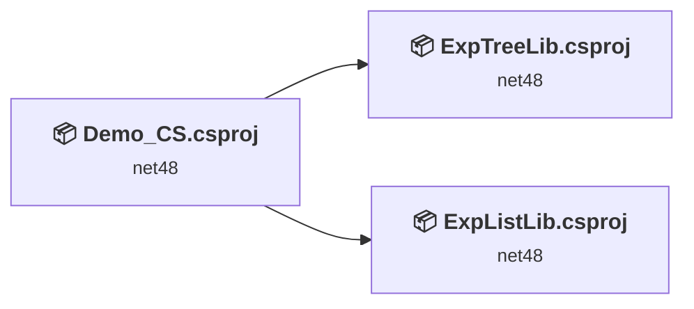
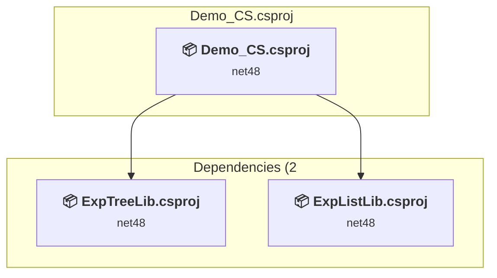
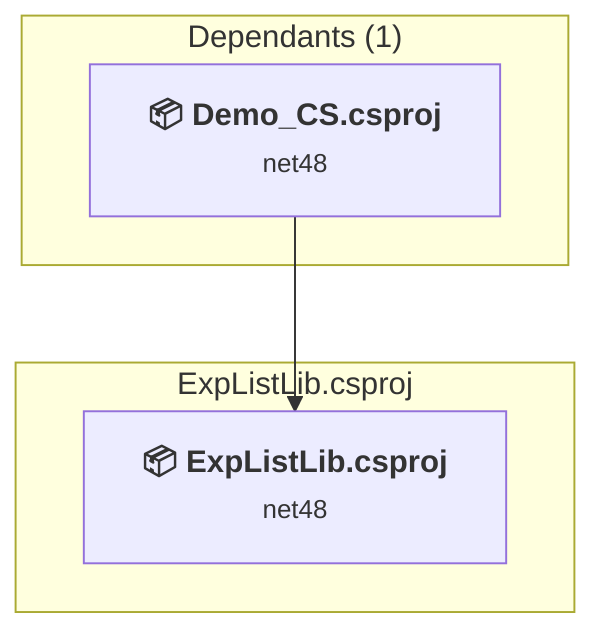
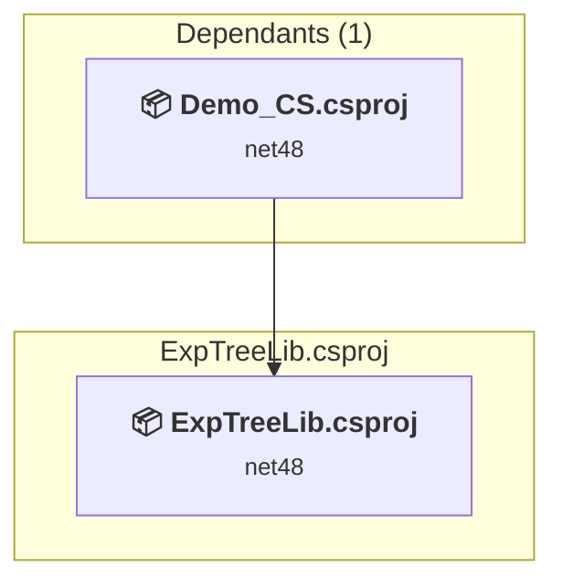

# Projects and dependencies analysis

This document provides a comprehensive overview of the projects and their dependencies in the context of upgrading to .NETCoreApp,Version=v10.0.

## Table of Contents

- [Executive Summary](#executive-Summary)
  - [Highlevel Metrics](#highlevel-metrics)
  - [Projects Compatibility](#projects-compatibility)
  - [Package Compatibility](#package-compatibility)
  - [API Compatibility](#api-compatibility)
- [Aggregate NuGet packages details](#aggregate-nuget-packages-details)
- [Top API Migration Challenges](#top-api-migration-challenges)
  - [Technologies and Features](#technologies-and-features)
  - [Most Frequent API Issues](#most-frequent-api-issues)
- [Projects Relationship Graph](#projects-relationship-graph)
- [Project Details](#project-details)

  - [Demo_CS\Demo_CS.csproj](#demo_csdemo_cscsproj)
  - [ExpListLib2\ExpListLib.csproj](#explistlib2explistlibcsproj)
  - [ExpTreeLib\ExpTreeLib.csproj](#exptreelibexptreelibcsproj)

## Executive Summary

### Highlevel Metrics

| Metric | Count | Status |
| :--- | :---: | :--- |
| Total Projects | 3 | All require upgrade |
| Total NuGet Packages | 0 | All compatible |
| Total Code Files | 53 |  |
| Total Code Files with Incidents | 26 |  |
| Total Lines of Code | 15056 |  |
| Total Number of Issues | 2333 |  |
| Estimated LOC to modify | 2330+ | at least 15.5% of codebase |

### Projects Compatibility

| Project | Target Framework | Difficulty | Package Issues | API Issues | Est. LOC Impact | Description |
| :--- | :---: | :---: | :---: | :---: | :---: | :--- |
| [Demo_CS\Demo_CS.csproj](#demo_csdemo_cscsproj) | net48 | 🟡 Medium | 0 | 113 | 113+ | WinForms, Sdk Style = True |
| [ExpListLib2\ExpListLib.csproj](#explistlib2explistlibcsproj) | net48 | 🟡 Medium | 0 | 874 | 874+ | ClassLibrary, Sdk Style = True |
| [ExpTreeLib\ExpTreeLib.csproj](#exptreelibexptreelibcsproj) | net48 | 🟡 Medium | 0 | 1343 | 1343+ | ClassLibrary, Sdk Style = True |

### Package Compatibility

| Status | Count | Percentage |
| :--- | :---: | :---: |
| ✅ Compatible | 0 | 0.0% |
| ⚠️ Incompatible | 0 | 0.0% |
| 🔄 Upgrade Recommended | 0 | 0.0% |
| ***Total NuGet Packages*** | ***0*** | ***100%*** |

### API Compatibility

| Category | Count | Impact |
| :--- | :---: | :--- |
| 🔴 Binary Incompatible | 2275 | High - Require code changes |
| 🟡 Source Incompatible | 50 | Medium - Needs re-compilation and potential conflicting API error fixing |
| 🔵 Behavioral change | 5 | Low - Behavioral changes that may require testing at runtime |
| ✅ Compatible | 7813 |  |
| ***Total APIs Analyzed*** | ***10143*** |  |

## Aggregate NuGet packages details

| Package | Current Version | Suggested Version | Projects | Description |
| :--- | :---: | :---: | :--- | :--- |

## Top API Migration Challenges

### Technologies and Features

| Technology | Issues | Percentage | Migration Path |
| :--- | :---: | :---: | :--- |
| Windows Forms | 2275 | 97.6% | Windows Forms APIs for building Windows desktop applications with traditional Forms-based UI that are available in .NET on Windows. Enable Windows Desktop support: Option 1 (Recommended): Target net9.0-windows; Option 2: Add <UseWindowsDesktop>true</UseWindowsDesktop>; Option 3 (Legacy): Use Microsoft.NET.Sdk.WindowsDesktop SDK. |
| GDI+ / System.Drawing | 12 | 0.5% | System.Drawing APIs for 2D graphics, imaging, and printing that are available via NuGet package System.Drawing.Common. Note: Not recommended for server scenarios due to Windows dependencies; consider cross-platform alternatives like SkiaSharp or ImageSharp for new code. |
| System Management (WMI) | 4 | 0.2% | Windows Management Instrumentation (WMI) APIs for system administration and monitoring that are available via NuGet package System.Management. These APIs provide access to Windows system information but are Windows-only; consider cross-platform alternatives for new code. |
| Legacy Configuration System | 2 | 0.1% | Legacy XML-based configuration system (app.config/web.config) that has been replaced by a more flexible configuration model in .NET Core. The old system was rigid and XML-based. Migrate to Microsoft.Extensions.Configuration with JSON/environment variables; use System.Configuration.ConfigurationManager NuGet package as interim bridge if needed. |

### Most Frequent API Issues

| API | Count | Percentage | Category |
| :--- | :---: | :---: | :--- |
| T:System.Windows.Forms.ListView | 168 | 7.2% | Binary Incompatible |
| T:System.Windows.Forms.TreeView | 153 | 6.6% | Binary Incompatible |
| T:System.Windows.Forms.TreeNode | 130 | 5.6% | Binary Incompatible |
| T:System.Windows.Forms.DragDropEffects | 95 | 4.1% | Binary Incompatible |
| T:System.Windows.Forms.Keys | 60 | 2.6% | Binary Incompatible |
| T:System.Windows.Forms.Control | 54 | 2.3% | Binary Incompatible |
| T:System.Windows.Forms.ListViewItem | 47 | 2.0% | Binary Incompatible |
| T:System.Windows.Forms.TreeNodeCollection | 46 | 2.0% | Binary Incompatible |
| T:System.Windows.Forms.ColumnHeader | 42 | 1.8% | Binary Incompatible |
| P:System.Windows.Forms.TreeNode.Nodes | 39 | 1.7% | Binary Incompatible |
| P:System.Windows.Forms.Control.Handle | 33 | 1.4% | Binary Incompatible |
| P:System.Windows.Forms.TreeNode.Tag | 32 | 1.4% | Binary Incompatible |
| T:System.Windows.Forms.View | 31 | 1.3% | Binary Incompatible |
| T:System.Windows.Forms.ListView.ListViewItemCollection | 31 | 1.3% | Binary Incompatible |
| P:System.Windows.Forms.ListView.Items | 31 | 1.3% | Binary Incompatible |
| T:System.Windows.Forms.ListView.SelectedListViewItemCollection | 30 | 1.3% | Binary Incompatible |
| P:System.Windows.Forms.ListView.SelectedItems | 30 | 1.3% | Binary Incompatible |
| T:System.Windows.Forms.ListViewItem.ListViewSubItemCollection | 30 | 1.3% | Binary Incompatible |
| P:System.Windows.Forms.ListViewItem.SubItems | 30 | 1.3% | Binary Incompatible |
| P:System.Windows.Forms.ListViewItem.Tag | 27 | 1.2% | Binary Incompatible |
| T:System.Windows.Forms.ListViewItem.ListViewSubItem | 24 | 1.0% | Binary Incompatible |
| T:System.Windows.Forms.MouseButtons | 21 | 0.9% | Binary Incompatible |
| T:System.Windows.Forms.SplitContainer | 20 | 0.9% | Binary Incompatible |
| P:System.Windows.Forms.ListViewItem.ListViewSubItemCollection.Item(System.Int32) | 18 | 0.8% | Binary Incompatible |
| P:System.Windows.Forms.Message.Msg | 17 | 0.7% | Binary Incompatible |
| T:System.Windows.Forms.SortOrder | 17 | 0.7% | Binary Incompatible |
| P:System.Windows.Forms.ListView.SelectedListViewItemCollection.Count | 16 | 0.7% | Binary Incompatible |
| P:System.Windows.Forms.TreeView.SelectedNode | 16 | 0.7% | Binary Incompatible |
| T:System.Windows.Forms.DockStyle | 15 | 0.6% | Binary Incompatible |
| E:System.Windows.Forms.Control.HandleCreated | 15 | 0.6% | Binary Incompatible |
| P:System.Windows.Forms.ListViewItem.ListViewSubItem.Tag | 14 | 0.6% | Binary Incompatible |
| T:System.Windows.Forms.KeyEventHandler | 14 | 0.6% | Binary Incompatible |
| T:System.Windows.Forms.MouseEventHandler | 14 | 0.6% | Binary Incompatible |
| T:System.Windows.Forms.Timer | 14 | 0.6% | Binary Incompatible |
| P:System.Windows.Forms.KeyEventArgs.KeyCode | 13 | 0.6% | Binary Incompatible |
| E:System.Windows.Forms.Control.HandleDestroyed | 13 | 0.6% | Binary Incompatible |
| P:System.Windows.Forms.Control.Name | 12 | 0.5% | Binary Incompatible |
| T:System.Windows.Forms.HorizontalAlignment | 12 | 0.5% | Binary Incompatible |
| M:System.Windows.Forms.TreeNodeCollection.Add(System.Windows.Forms.TreeNode) | 12 | 0.5% | Binary Incompatible |
| T:System.Windows.Forms.NodeLabelEditEventHandler | 12 | 0.5% | Binary Incompatible |
| T:System.Windows.Forms.TreeViewCancelEventHandler | 12 | 0.5% | Binary Incompatible |
| P:System.Windows.Forms.ListView.View | 11 | 0.5% | Binary Incompatible |
| P:System.Windows.Forms.ListView.SelectedListViewItemCollection.Item(System.Int32) | 11 | 0.5% | Binary Incompatible |
| T:System.Windows.Forms.ListView.ColumnHeaderCollection | 10 | 0.4% | Binary Incompatible |
| P:System.Windows.Forms.ListView.Columns | 10 | 0.4% | Binary Incompatible |
| F:System.Windows.Forms.DragDropEffects.None | 10 | 0.4% | Binary Incompatible |
| M:System.Windows.Forms.TreeNode.#ctor(System.String) | 10 | 0.4% | Binary Incompatible |
| T:System.Windows.Forms.Application | 9 | 0.4% | Binary Incompatible |
| T:System.Windows.Forms.AutoScaleMode | 9 | 0.4% | Binary Incompatible |
| P:System.Windows.Forms.Control.IsHandleCreated | 9 | 0.4% | Binary Incompatible |

## Projects Relationship Graph

Legend:
📦 SDK-style project
⚙️ Classic project

## Project Details

### Demo_CS\Demo_CS.csproj

#### Project Info

- **Current Target Framework:** net48
- **Proposed Target Framework:** net10.0-windows
- **SDK-style**: True
- **Project Kind:** WinForms
- **Dependencies**: 2
- **Dependants**: 0
- **Number of Files**: 8
- **Number of Files with Incidents**: 5
- **Lines of Code**: 290
- **Estimated LOC to modify**: 113+ (at least 39.0% of the project)

#### Dependency Graph

Legend:
📦 SDK-style project
⚙️ Classic project

### API Compatibility

| Category | Count | Impact |
| :--- | :---: | :--- |
| 🔴 Binary Incompatible | 111 | High - Require code changes |
| 🟡 Source Incompatible | 2 | Medium - Needs re-compilation and potential conflicting API error fixing |
| 🔵 Behavioral change | 0 | Low - Behavioral changes that may require testing at runtime |
| ✅ Compatible | 110 |  |
| ***Total APIs Analyzed*** | ***223*** |  |

#### Project Technologies and Features

| Technology | Issues | Percentage | Migration Path |
| :--- | :---: | :---: | :--- |
| Legacy Configuration System | 2 | 1.8% | Legacy XML-based configuration system (app.config/web.config) that has been replaced by a more flexible configuration model in .NET Core. The old system was rigid and XML-based. Migrate to Microsoft.Extensions.Configuration with JSON/environment variables; use System.Configuration.ConfigurationManager NuGet package as interim bridge if needed. |
| Windows Forms | 111 | 98.2% | Windows Forms APIs for building Windows desktop applications with traditional Forms-based UI that are available in .NET on Windows. Enable Windows Desktop support: Option 1 (Recommended): Target net9.0-windows; Option 2: Add <UseWindowsDesktop>true</UseWindowsDesktop>; Option 3 (Legacy): Use Microsoft.NET.Sdk.WindowsDesktop SDK. |

### ExpListLib2\ExpListLib.csproj

#### Project Info

- **Current Target Framework:** net48
- **Proposed Target Framework:** net10.0
- **SDK-style**: True
- **Project Kind:** ClassLibrary
- **Dependencies**: 0
- **Dependants**: 1
- **Number of Files**: 8
- **Number of Files with Incidents**: 5
- **Lines of Code**: 1254
- **Estimated LOC to modify**: 874+ (at least 69.7% of the project)

#### Dependency Graph

Legend:
📦 SDK-style project
⚙️ Classic project

### API Compatibility

| Category | Count | Impact |
| :--- | :---: | :--- |
| 🔴 Binary Incompatible | 854 | High - Require code changes |
| 🟡 Source Incompatible | 20 | Medium - Needs re-compilation and potential conflicting API error fixing |
| 🔵 Behavioral change | 0 | Low - Behavioral changes that may require testing at runtime |
| ✅ Compatible | 1384 |  |
| ***Total APIs Analyzed*** | ***2258*** |  |

#### Project Technologies and Features

| Technology | Issues | Percentage | Migration Path |
| :--- | :---: | :---: | :--- |
| Windows Forms | 854 | 97.7% | Windows Forms APIs for building Windows desktop applications with traditional Forms-based UI that are available in .NET on Windows. Enable Windows Desktop support: Option 1 (Recommended): Target net9.0-windows; Option 2: Add <UseWindowsDesktop>true</UseWindowsDesktop>; Option 3 (Legacy): Use Microsoft.NET.Sdk.WindowsDesktop SDK. |

### ExpTreeLib\ExpTreeLib.csproj

#### Project Info

- **Current Target Framework:** net48
- **Proposed Target Framework:** net10.0
- **SDK-style**: True
- **Project Kind:** ClassLibrary
- **Dependencies**: 0
- **Dependants**: 1
- **Number of Files**: 42
- **Number of Files with Incidents**: 16
- **Lines of Code**: 13512
- **Estimated LOC to modify**: 1343+ (at least 9.9% of the project)

#### Dependency Graph

Legend:
📦 SDK-style project
⚙️ Classic project

### API Compatibility

| Category | Count | Impact |
| :--- | :---: | :--- |
| 🔴 Binary Incompatible | 1310 | High - Require code changes |
| 🟡 Source Incompatible | 28 | Medium - Needs re-compilation and potential conflicting API error fixing |
| 🔵 Behavioral change | 5 | Low - Behavioral changes that may require testing at runtime |
| ✅ Compatible | 6319 |  |
| ***Total APIs Analyzed*** | ***7662*** |  |

#### Project Technologies and Features

| Technology | Issues | Percentage | Migration Path |
| :--- | :---: | :---: | :--- |
| System Management (WMI) | 4 | 0.3% | Windows Management Instrumentation (WMI) APIs for system administration and monitoring that are available via NuGet package System.Management. These APIs provide access to Windows system information but are Windows-only; consider cross-platform alternatives for new code. |
| GDI+ / System.Drawing | 12 | 0.9% | System.Drawing APIs for 2D graphics, imaging, and printing that are available via NuGet package System.Drawing.Common. Note: Not recommended for server scenarios due to Windows dependencies; consider cross-platform alternatives like SkiaSharp or ImageSharp for new code. |
| Windows Forms | 1310 | 97.5% | Windows Forms APIs for building Windows desktop applications with traditional Forms-based UI that are available in .NET on Windows. Enable Windows Desktop support: Option 1 (Recommended): Target net9.0-windows; Option 2: Add <UseWindowsDesktop>true</UseWindowsDesktop>; Option 3 (Legacy): Use Microsoft.NET.Sdk.WindowsDesktop SDK. |

